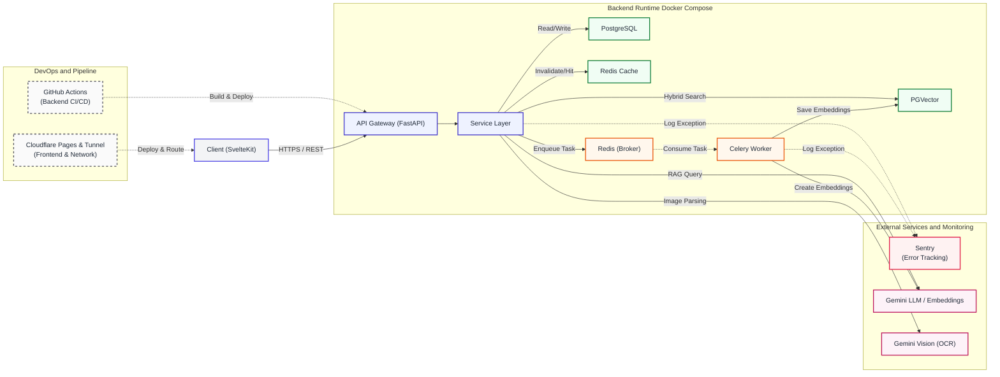

# Dules: AI 문맥 기반 스케쥴러

> 바쁜 현대인을 위한 AI 문맥 인식 일정 관리 서비스 - **Dules**

> **Demo:** [https://openschedule.store](https://openschedule.store)

> "단순한 메모와 사진이 자동으로 내 캘린더에 정리된다면 어떨까?" 라는 생각에서 출발한 사이드 프로젝트입니다.
>
> 백엔드 엔지니어로서 **유지보수하기 좋은 아키텍처**와 **외부 API(AI) 연동 시 발생하는 성능 병목 해결**에 집중하여 개발했습니다.

---

## 기술 스택

* **Backend:** Python 3.12, FastAPI, SQLAlchemy (Async)
* **Database & Cache:** PostgreSQL, pgvector (Vector DB), Redis
* **Background Job:** Celery
* **AI & API:** Google Gemini 2.5/3 Flash API (OCR & LLM), LangChain
* **Frontend:** SvelteKit, Tailwind CSS, FullCalendar
* **Infra:** Sentry (Error Tracking), Docker & Docker Compose, Github Action(Backend CI/CD), CloudFlare (Frontend CI/CD)

---

## 핵심 기능

* **AI Vision 일정 자동 등록:** 청첩장, 수첩 메모 등 이미지 업로드 시 Gemini 2.5 Flash 모델이 OCR 및 문맥을 분석하여 정형화된 일정(Event/Task/Memo)으로 자동 변환.
* **자연어 기반 하이브리드 검색 (RAG):** "저번 주에 회의했던 내용 찾아줘"와 같은 일상어로 질문 시 PGVector 기반의 의미론적 검색과 SQL 조건 검색을 융합하여 최적의 과거 기록 반환.
* **안전한 인증 및 상태 관리:** JWT (Access/Refresh Token) 기반 인증 체계와 Redis를 활용한 블랙리스트 및 세션 관리.

---

## 아키텍처 및 설계 주안점

1. **관심사의 분리 (SoC) 및 의존성 주입 (DI):** 비즈니스 로직과 외부 인프라를 완전히 분리. 인터페이스(Protocol)에만 의존하여 향후 LLM 모델이나 DB 엔진 변경 시 비즈니스 로직의 수정 없이 어댑터만 교체할 수 있는 구조(Ports and Adapters) 채택.
2. **비동기 분산 처리 (Celery):** 일정 생성 시 수반되는 무거운 Vector Embedding 작업을 Main API Thread에서 분리하여 Celery Worker로 비동기 위임. API 응답 속도 최적화.
3. **데이터 캐싱 전략:** 빈번하게 조회되는 일정 목록은 Redis Cache를 활용하여 DB 부하 감소 및 응답 속도 개선. 데이터 변경(C/U/D) 시 Cache Invalidation 적용.



---

## 실행 방법

```
# 1. 환경변수 설정 (.env.example -> .env)
# 프로젝트 루트 디렉토리에 `.env` 파일을 생성하고 아래 값을 채워주세요. (참고: `.env.example`)

# 데이터베이스 연결 주소
DATABASE_URL="your_database_url"

# Redis 서버 주소
REDIS_URL="your_redis_url_here"

# Sentry DSN
SENTRY_SDK_DSN = "your_sentry_sk_dsn"

# CloudFlare tunnel
TUNNEL_TOKEN="your_cloudflare_tunneling_calue"

# Docker 환경에서 사용할 구글 API 키
GOOGLE_API_KEY_FOR_DOCKER="your_google_api_key_here"

# 사용할 구글 임베딩 모델명
GOOGLE_EMBEDDINGS_MODEL="your_google_embeddings_model_name"

# 기본 구글 AI 서비스 API 키
GOOGLE_API_KEY="your_google_api_key_here"

# 보안 및 토큰 서명용 비밀키 (임의의 긴 문자열)
SECRET_KEY="your_random_secret_key_here"

# 토큰 암호화 알고리즘 (예: HS256)
ALGORITHM="HS256"

#2. Docker Compose로 백그라운드 서비스 컨테이너 실행 (Fastapi, Celery)
# Redis와 PostgreSQL은 외부 서비스 연결 또는 로컬 Docker에 설치
docker-compose up -d redis db
```
